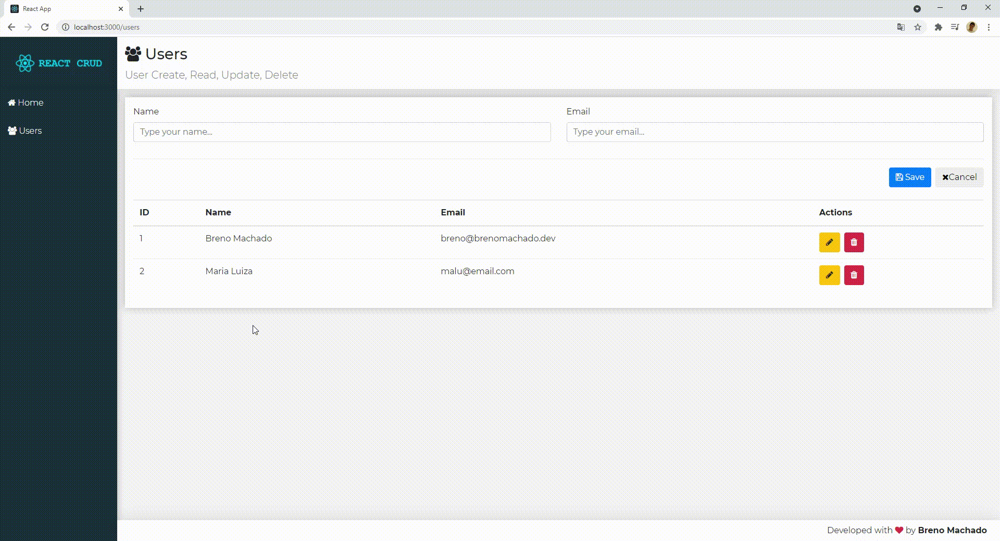

# React User CRUD
A simple User CRUD with React and JsonServer

## Screenshots


## Dependencies
- NodeJS
- ReactJS
- JsonServer

## Dev dependencies
To run on dev environment run:

``Backend:``
```sh
cd backend
npm install
npm start
```
> The backend will run on http://localhost:3001
> 
``Frontend:``
```sh
cd frontend
npm install
npm start
```
> The frontend will run on http://localhost:3000

## See more
For more information about me or other projects: [brenomachado.dev](https://brenomachado.dev)